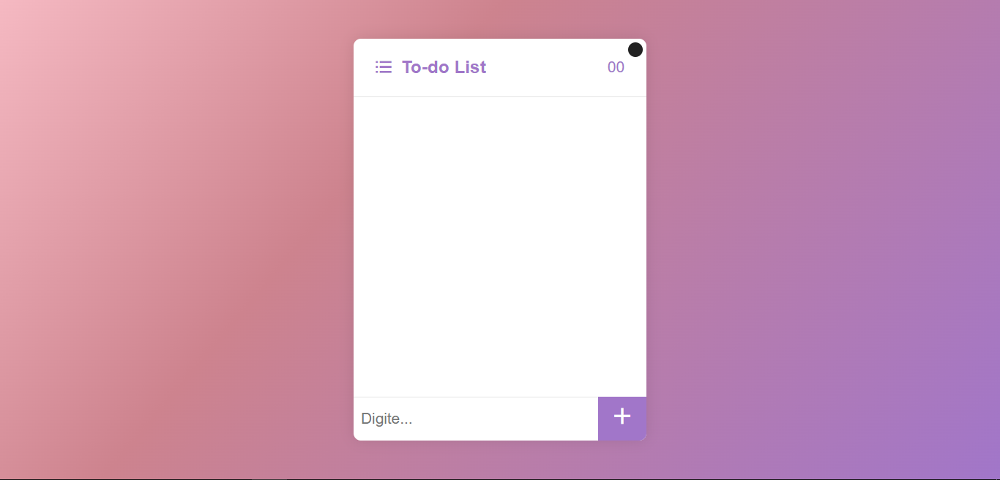
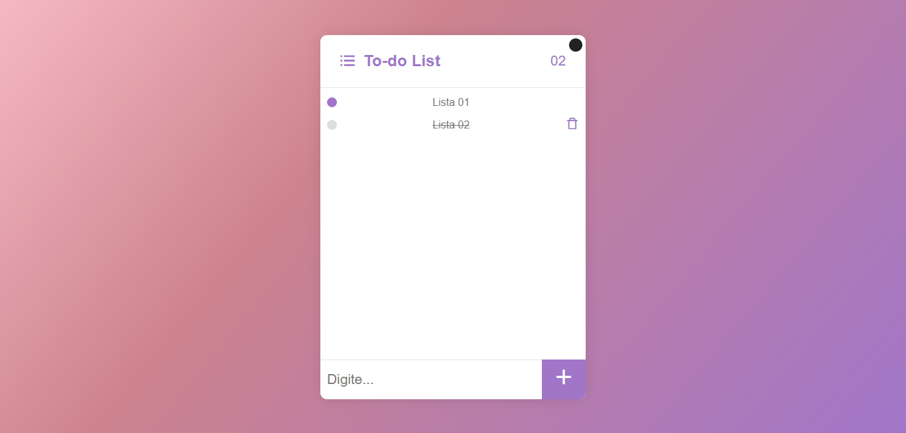
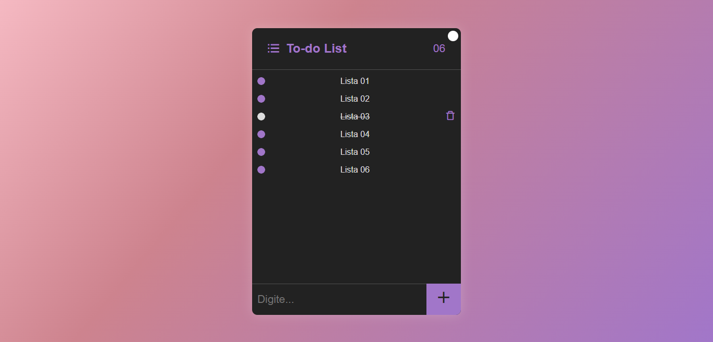

Crio um sistema de to-do lista, com salvamento no LocalStorage

Crio um sistema de To-do List com o salvamento de dados no LocalStorage do navegador. Template do projeto:

Já colocando as "listas", terá o contador da quantidade de listas e após selecionar alguma, será possível excluir, como mostra na imagem:

No card, também é possível mudar oara o modo dark, melhorando a experiênncia do usiário, como mostra na imagem:

